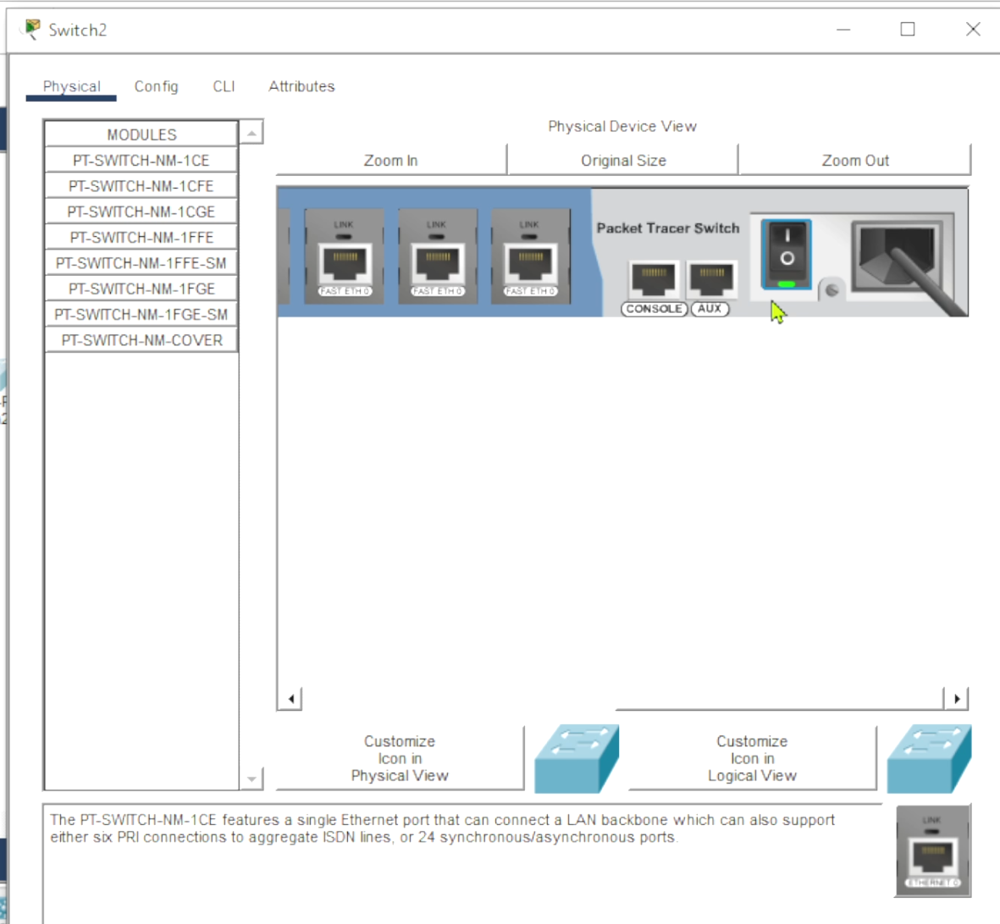
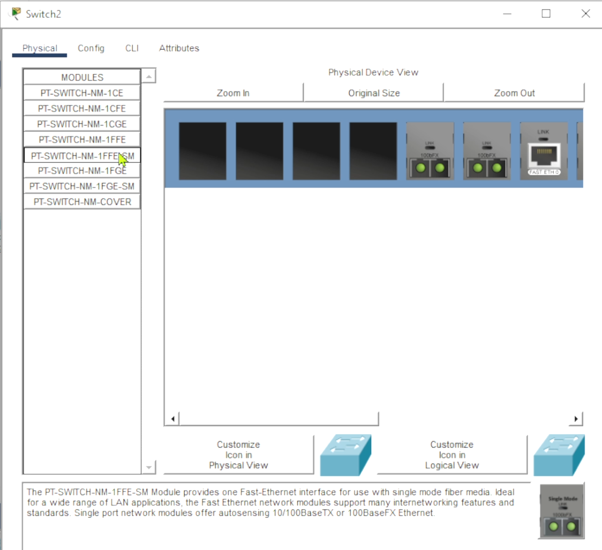
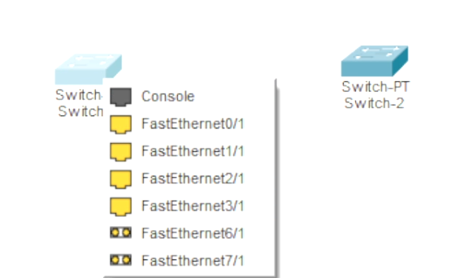
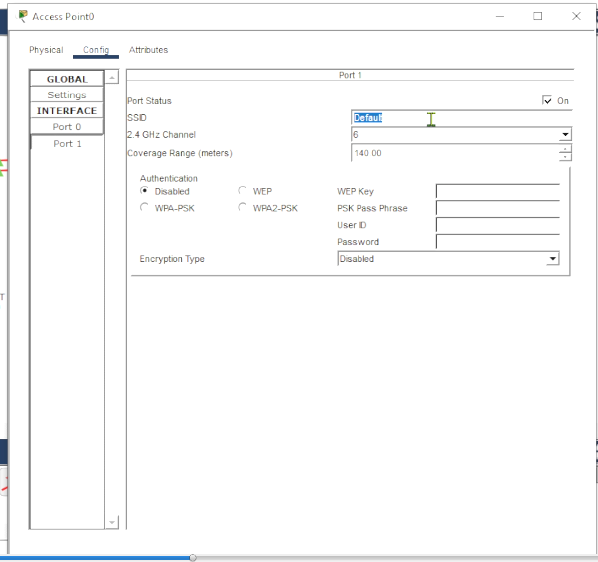
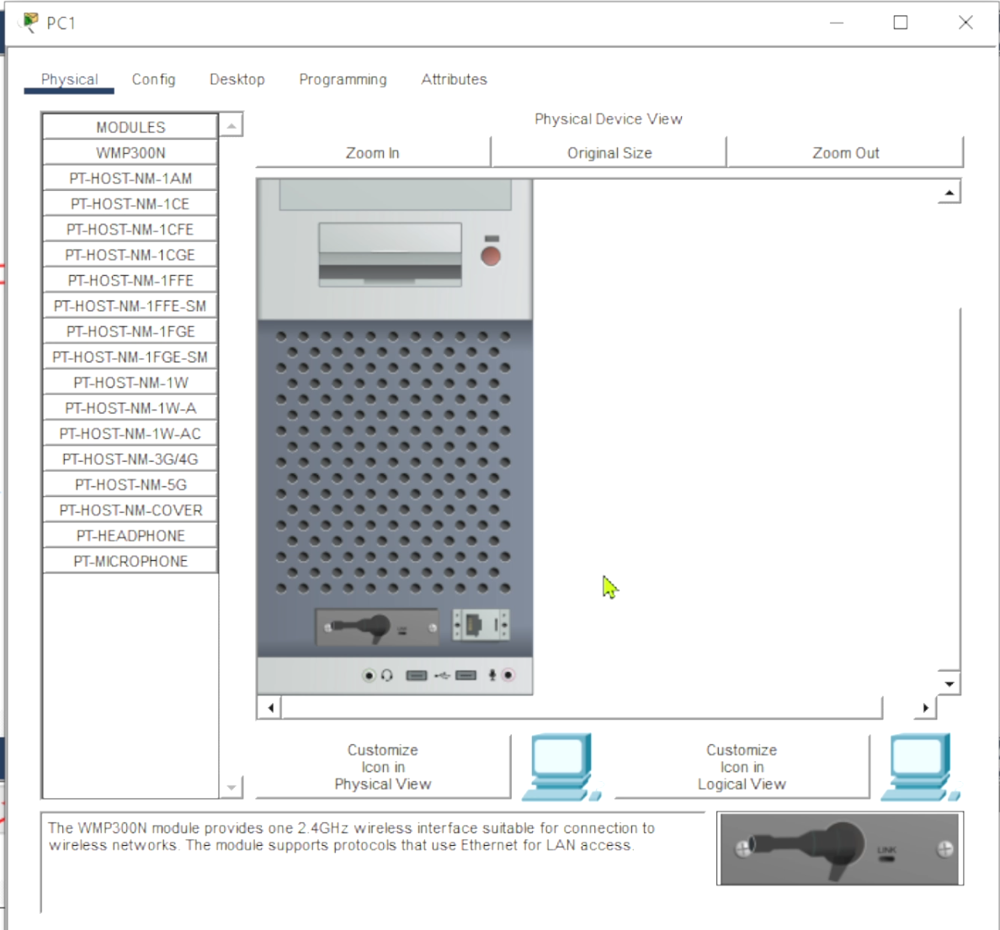
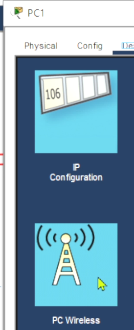
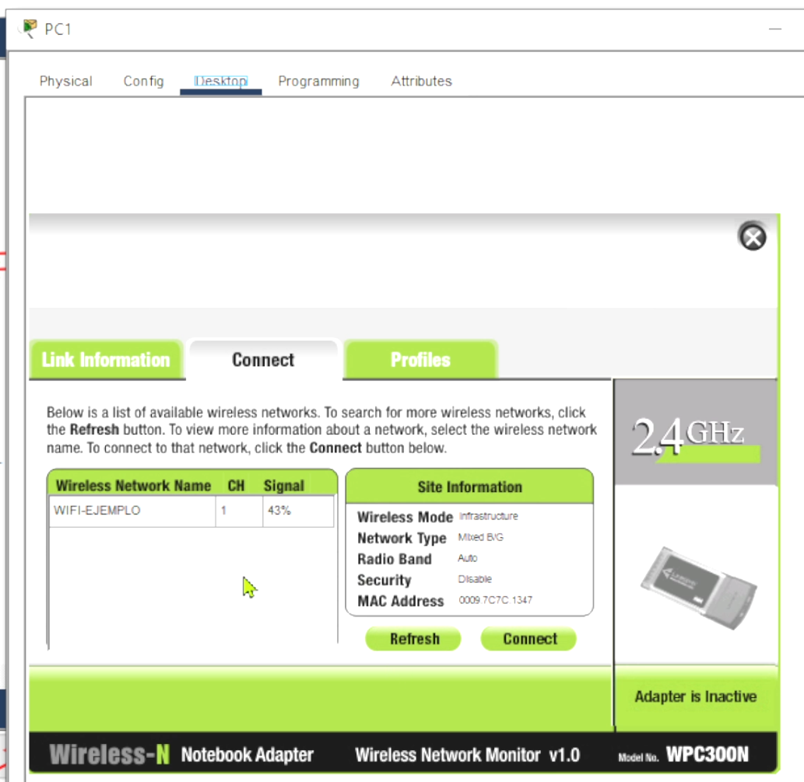

## *NOTA: RESUMEN CONCISO, REVISAR GRABACION*
# Agregar módulo a dispositivo (FIBRA)
### 1. Apagar el dispositivo presionando el botón

### 2. Seleccionar y arrastrar el módulo que deseamos colocar.

### 3. Utilizar los nuevos módulos para las conexiones.

# Configuración de Access Point
### 1. Para acces point, primero nos vamos a la interfaz port 1 y le cambiamos el SSID, opcionalmente se le coloca autenticación.

### 2. Cambiamos el módulo de la computadora a uno inalámbrico.

### 3. Seleccionamos el apartado de "PC Wireless" en Desktop.

### 4. Nos vamos a "Connect" y buscamos la red inalámbrica (SSID) seleccionamos y le damos a "Connect"
